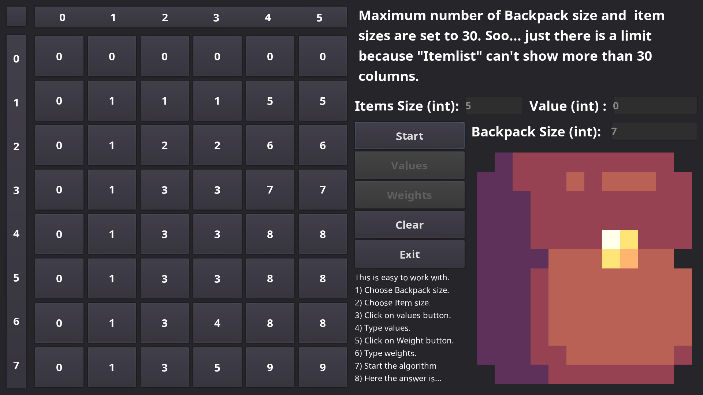

# Backpack Problem

Here is a UI view with values and weights we put in as our items and backpack size as capacity of our backpack based on weight.\
I used [**Dynamic Programming**](https://en.wikipedia.org/wiki/Dynamic_programming) as a way of solving backpack problem.

## Game Scene

### How To Use
1. Fill in **Item Size** and **Backpack Size** and then click on **Values** button.
2. Now start adding number in **Value** and press enter to go to next item until all of items get a value and textbox is not usable anymore.
3. After that click on **Weights** and do the save we did in previous.
4. Now click on Start and here is the solution.

Hope everyone love it. 😊